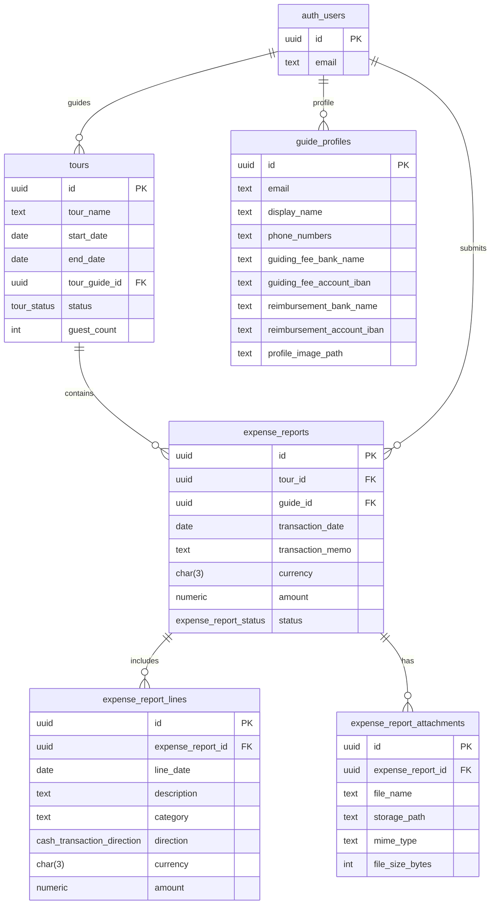

# Initial Database Schema

This is the simplified first-pass Supabase schema for Guide Cash Tracking.

## Core entities

### Tour guides
- Tour guides are Supabase Auth users.
- No separate `tour_guides` table is used yet.
- `auth.users.id` is referenced by application tables as the guide identity.

### Tours
- `tour_name`
- `start_date`
- `end_date`
- `tour_guide_id` -> `auth.users.id`
- `status`:
  - `not_started` = red
  - `in_progress` = yellow
  - `finished` = green
- `guest_count`

### Guide profiles
- `id` -> `auth.users.id`
- `email`
- `display_name`
- `phone_numbers`
- `guiding_fee_bank_name`
- `guiding_fee_account_iban`
- `reimbursement_bank_name`
- `reimbursement_account_iban`
- `profile_image_path`

### Expense reports
- `tour_id` -> `tours.id`
- `guide_id` -> `auth.users.id`
- `transaction_date`
- `transaction_memo`
- `currency`
- `amount`
- `status`:
  - `not_submitted` = red
  - `submitted` = yellow
  - `processed` = green
- `running_balance` is derived from report order and carries over into the next tour.

### Expense report lines
- `expense_report_id` -> `expense_reports.id`
- `line_date`
- `description`
- `category`
- `direction`:
  - `money_in`
  - `money_out`
- `currency`
- `amount`

### Expense report attachments
- `expense_report_id` -> `expense_reports.id`
- `file_name`
- `storage_path`
- `mime_type`
- `file_size_bytes`

## Relationship summary

## Notes
- The schema is intentionally minimal.
- `tour_guides` can be added later if profile-specific data becomes necessary.
- `updated_at` is included for future editing flows.
- Owner-based RLS is enabled on `tours` and `expense_reports`.
- For the browser demo, `anon` can read seeded `tours`, `expense_reports`, and `expense_report_lines`.
- For the browser demo, `anon` can read `guide_profiles`.
- For the browser demo, `anon` can read `expense_report_attachments` and the dashboard overview view.
- Each guide can still only add or edit rows where the ownership column matches their `auth.uid()`.
- Tours are public-read and add-only for the owning guide.
- Expense reports are public-read and add/update/delete only for the owning guide.
- Expense report lines are public-read and add/update/delete only for the owning guide through the parent report.
- Expense report attachments are public-read and add/update/delete only for the owning guide through the parent report.
- Guide profiles are public-read only for demo rendering.
- Table access is limited to authenticated users.
- The dashboard reads from a database view so guide, tour, balance, and attachment totals are derived in Postgres.