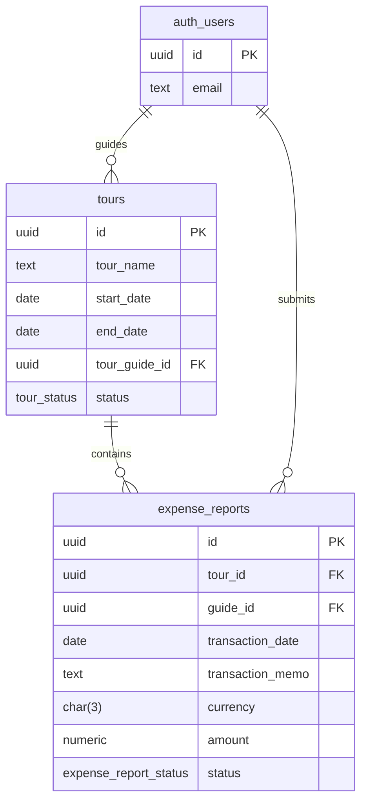

# Initial Database Schema

This is the simplified first-pass Supabase schema for Guide Cash Tracking.

## Core entities

### Tour guides
- Tour guides are Supabase Auth users.
- No separate `tour_guides` table is used yet.
- `auth.users.id` is referenced by application tables as the guide identity.

### Tours
- `tour_name`
- `start_date`
- `end_date`
- `tour_guide_id` -> `auth.users.id`
- `status`:
  - `not_started` = red
  - `in_progress` = yellow
  - `finished` = green

### Expense reports
- `tour_id` -> `tours.id`
- `guide_id` -> `auth.users.id`
- `transaction_date`
- `transaction_memo`
- `currency`
- `amount`
- `status`:
  - `not_submitted` = red
  - `submitted` = yellow
  - `processed` = green

## Relationship summary

## Notes
- The schema is intentionally minimal.
- `tour_guides` can be added later if profile-specific data becomes necessary.
- `updated_at` is included for future editing flows.
- RLS policies are not defined yet and should be added before exposing data.